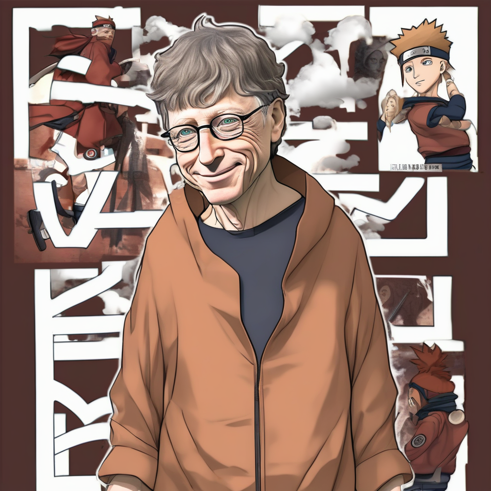
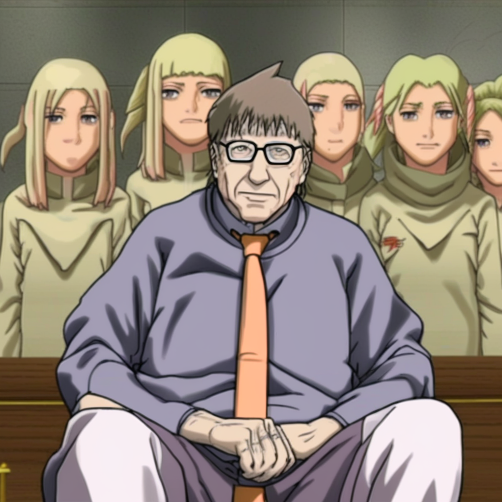

# Naruto-Style Fine-Tuning on SDXL

## 1. Task Overview
The aim is to adapt a large text-to-image diffusion model (SDXL) to a new style domain under heavy GPU constraints.

### Objective
Fine-tune [Stable Diffusion XL Base 1.0](https://huggingface.co/stabilityai/stable-diffusion-xl-base-1.0) to generate high-quality 1024×1024 Naruto-style images.

### Dataset
 HuggingFace: [lambdalabs/naruto-blip-captions](https://huggingface.co/datasets/lambdalabs/naruto-blip-captions)
### Hardware Constraint
- Must work end-to-end on free Google Colab
- Only T4 GPU (16GB VRAM) available
- No paid GPUs used

## 2. Proposed Solutions
This repo provides two solutions, each offering a different strategy for teaching SDXL the Naruto style.

### Solution 1 — SDXL LoRA
File: SDXL_LORA_RES_1024_RUNNING.ipynb
[LoRA (Low-Rank Adaptation)](https://arxiv.org/abs/2106.09685) is a parameter efficient fine-tuning method for large diffusion models. Instead of updating all model weights which is slow and memory heavy, LoRA injects small trainable rank decomposition matrices into the attention layers. During training, only these lightweight adapters are updated, making fine-tuning faster, cheaper, and GPU-friendly while preserving the base model’s quality.

#### Why LoRA works for style training?
In style fine-tuning, we aren not trying to teach the model new objects. We are teaching it how things should look.
The “look” of an image (line thickness, color scheme, shading) is encoded inside the attention layers, so LoRA can learn these stylistic changes extremely efficiently.
This allows SDXL to adopt the Naruto style without retraining billions of parameters.

#### SDXL LoRA Implementation Explanation
1. Freeze the entire SDXL Model: All original SDXL weights are untouched (UNet frozen, VAE frozen, Text Encoders frozen)
2. Inject LoRA layers only into SDXL’s attention blocks: This focuses learning exactly where style information is processed. We use rank=64
3. Train on the [modified Naruto BLIP dataset](https://huggingface.co/datasets/sprodem/naruto-style-sdxl): The original BLIP captions of the dataset were appended with "Naruto animation style"
4. Other Optimizations Used:
   - Gradient Checkpointing — “Recompute instead of store”Normally, GPUs must store intermediate activations during forward pass. These activations take enormous memory at 1024px. Gradient checkpointing does not save them but recomputes during backward pass.
   - 8-bit AdamW — The AdamW optimizer normally stores Weights, Momentum, and Variance in full 32-bit precision. In 8-bit AdamW, momentum & variance use only 8 bits which cuts their memory usage in half and doesn't affect training quality significantl.
   - Mixed Precision (FP16) — FP16 uses 16-bit floating point numbers instead of 32-bit. This reduces VRAM by nearly 50% in activations, gradients, and model parameters.
   - Checkpointing after every step: If training crashes due to OOM, we can resume instantly without losing progress.

### Solution 2 — SDXL DreamBooth
[DreamBooth](https://arxiv.org/abs/2208.12242) is a fine-tuning technique that teaches a diffusion model to deeply understand and reproduce a specific subject or style using a small set of reference images (typically 3–10). It learns unique identity features like a person, character, object, or art style—and integrates them into the model so we can generate new images of that subject in any pose, environment, or context using a special trigger word.
#### SDXL DreamBooth Implementation Explanation
1. DreamBooth does not require a very large dataset. We sampled 50 random images from the Naruto dataset for fine-tuning.
2. Introduced a new trigger token: "Naruto anime character". SDXL is fine-tuned on this token so that whenever you use this token, the model outputs images in Naruto-like appearance.
3. Applied LoRA on top of DreamBooth: A full DreamBooth fine-tune for SDXL is not possible on 16GB VRAM. We combine DreamBooth (token-based concept learning) and LoRA (lightweight parameter updates)
4. Other Optimizations Used: We reuse optimizations use in solution 1 (Gradient checkpointing, Mixed precision (fp16), 8-bit AdamW, Step-wise checkpoint saving)

## 3. Visual Results
Comparing the results from the original SDXL pipeline, Solution-1(LoRA), and Solution-2(DreamBooth).
Prompt: Bill Gates in Naruto style
<table>
  <tr>
    <td align="center">
       
      <b>Original Pipeline</b>
    </td>
    <td align="center">
       
      <b>Fine-tuned using LoRA</b>
    </td>
    <td align="center">
       
      <b>Fine-tuned using DreamBooth</b>
    </td>
  </tr>
</table>

## 4. Future Work
1. Use [DoRA (Weight-Decomposed LoRA)](https://arxiv.org/abs/2402.09353) : DoRA improves upon LoRA by decomposing weight magnitude & direction separately. Provides better fine-tuning and more stable style retention.
2. Use xFormers attention : xFormers includes highly efficient attention kernels that can reduce VRAM usage, improve speed and allow bigger batches.

## References
   * [Flex AI article](https://www.flex.ai/blueprints/fine-tuning-a-stable-diffusion-xl-with-lora)
   * [SDXL Paper](https://arxiv.org/abs/2112.10752)

